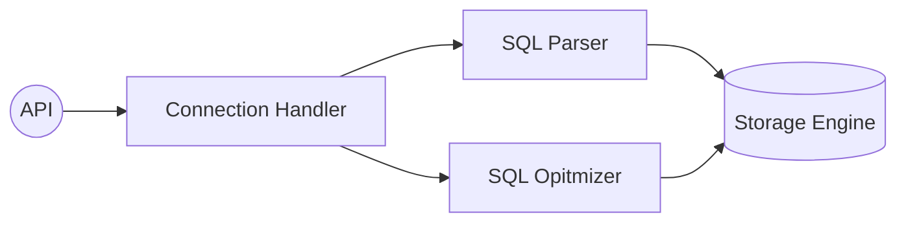

# MySQL Architecture


- MySQL Server
    - MySQL Engine : 단일, SQL 분석/최적화
        - Connection Handler : 접속 및 쿼리 요청 처리
        - SQL Parser : SQL 전처리 및 파싱
        - SQL Opitmizer : 최적화

    - Storage Engine : 다수, 데이터 R/W (EX. `InnoDB`)
        - 성능 향상을 위한 key cache, buffer pool 내장
        - Handler API : 두 종류의 Engine을 연결하는 API

    - Thread 기반 작동, Foreground/Background thread로 구분
        - Edition에 따라 전통적 thread model/thread pool model로 나뉨
        - Foreground(Client)
            - Client 수만큼 존재, client 요청 쿼리 처리.
            - Connection 종료 시, Thread cache로 반환. Cache 내 thread 수 제한.
            - Data를 Buffer/Cache에서 우선 read, 없는 경우에 disk 접근.
        - Background
            - 주요 역할
                - Insert Buffer merge
                - Log를 Disk에 write(Log thread)
                - Buffer pool write(Write thread)
                - Data를 Buffer로 read
                - Lock, Deadlock monitor
            
            - Write는 지연(Buffering) 가능, Read는 불가능
                - Write buffering으로 일괄 처리
                - But, `MyISAM`은 foreground가 Disk write 까지 수행, Buffering 미수행
    
    - Memory 할당/구조
        - Global
            - OS로부터 MySQL 시작 시 할당
            - Thread 수와 무관하게 메모리 공간 할당
            - 모든 Thread가 공유
            - Table cache / Buffer pool / Hash index / Log buffer

        - Local(Session)
            - Client thread가 쿼리를 처리
            - Client 접속 시 할당
            - Thread 별로 독립적 할당, 공유되지 않음
            - Buffer에 따라 쿼리를 실행할 때만 할당 될 수도(sort, join)
            - Connection buffer / Sort buffer / Join buffer

    - MySQL Plugin Storage model
        - 기본 stroage model 외로, 다양한 요구를 맞추기 위해 부가 기능 보유
        - 이에, Data IO 부분 Custom 가능
        - Handler : 특정 기능을 호출하기 위한 객체
            - MySQL engine이 사람, Storage engine이 자동차라면, Handler는 핸들에 비유 가능
            - `Handler_` 접두 변수는 명령의 횟수 저장
        - `GROUP BY`, `ORDER BY`등 복잡한 처리는 Query 실행기에 담당(MySQL engine)

        - 하나의 Query는 복수의 하위 작업들로 나뉘며, 각 작업은 ME 혹은 SE에 의해 처리됨
        - 이외에 인증/전문 검색 파서/퀴리 재작성과 같은 Plugin 존재

    - Component
        - 8 버전부터 plugin 대체하기 위해 지원
        - Plugin architecture의 단점
            - 오직 server와 interface, plugin끼리는 불가
            - server 변수, 함수를 직접 호출하기에 위험(캡슐화x)
            - 상호 의존 관계 설정 불가, 초기화 어려움

- Query 실행 구조
    ```mermaid
    flowchart LR
    A((User))--Request-->B[Query Parser]
    B-->C[Preprocessor]
    C-->D[Opitmizer]
    D-->E[(Storage Engine)]
    E-->D
    D--Result-->A
    ```
    ----
    - Query Parser
        - Query를 token으로 분리
        - token으로 Tree 구조를 만드는 작업
        - 문법 오류 검출
    - Preprocessor
        - Parser tree 기반으로 구조적 문제 확인
        - 각 token으로 해당 객체 존재/접근권한 확인
    - Optimizer
        - 최적화 담당(저렴하고, 빠르게 처리), 두뇌 역할
        - optimizer가 더 나은 선택을 할 수 있도록 유도 필요
    - Execution Engine
        - engine은 중간관리자
    - Handler(Storage Engine)
        - handler는 실무자 역할
        - Disk로부터 Data IO
        - Handler는 곧 SE를 의미
    - Replication
    - Query Cache
        - Web app에서 중히 요구
        - Memory에 caching, 동일 query 실행 시 테이블을 읽지 않음
            - Write는 거의 없고 Read가 많은 환경에서 유용(흔치 않음)
        - 그러나, table data 변경 시, cache에서 관련 항목은 모두 invalidate 해야함
            - 이에 따른 성능 저하 및 버그 원인 발생
        - 8버전에서 완전 제거
    - Thread Pool
        - Enterprise 제공
        - 내부적인 thread 갯수 감소
            - CPU가 제한된 thread에만 집중
            - 서버의 자원 소모 감경
            - Process Affinity 상승, 불필요한 Context Switch 감소
            - CPU 시간을 제대로 확보하지 못하면 오히려 처리 속도가 느려짐
        - Thread group은 CPU 코어 수 만큼 생성
            - 모든 thread가 busy면, 새 worker thread를 추가할지, 기존 thread 처리완료를 기다릴지 결정
            - Timer thread가 주기적으로 thread group 상태 체크
                - 지정된 시간 `thread_pool_stall_limit`안에 작업처리를 완료하지 못하면, new thread 생성
                - 응답 시간에 민감한 service는 해당 변수를 낮게 유지
        - 선/후순위 Queue를 통해 특정 query를 우선/나중에 처리 가능
            - Lock race 감소 효과 기대
    - Metadata supporting Transaction
        - Data Dictionary/Metadata : Table 구조 정보 및 Stored program 등...
        - 정작 Metadata는 transaction 지원이 안되어 비정상 종료 시 문제 발생
        - 8버전 부터는 table에 저장하도록 개선(System Table)
            - `mysql.ibd` table space에 저장

- InnoDB Stroage Engine Architecture
    - Architecture
        - Memory
            - Log Buffer
            - Buffer Pool
        - CPU
            - Background Thread
        - Disk
            - Data File
            - Transaction Log File

    - Clustrering By Primary Key
        - 모든 테이블은 PK를 기준으로 Clustering되어 저장
        - PK값 순서대로 disk에 ㅈ저아